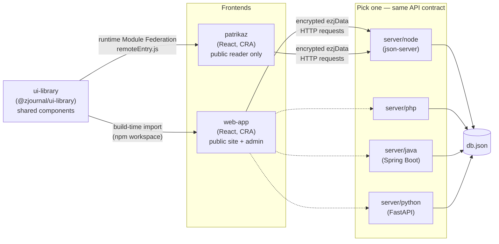

# Architecture

This doc explains how the pieces of the zJournal monorepo fit together. For "how do I run this,"
see the root [README.md](../README.md); for "how do I deploy this," see
[DEPLOYMENT.md](DEPLOYMENT.md); for "how do I use the app," see [USER_GUIDE.md](USER_GUIDE.md).

## The pieces

- **`web-app`** — the main React + TypeScript app: the public reading site (`/web/*`) and the
  content-management admin panel (`/admin/*`), sharing one React app shell, router, and state
  layer. See root README's [How it works](../README.md#how-it-works) section for the request flow.
- **`patrikaz`** — a second, independent reader app covering the same public "web" surface (Home,
  About, Article, Article listings) minus Contact/Q&A. It's deliberately **not** an npm workspace
  member and has zero compile-time dependency on `ui-library` — it's a proof that the reading
  experience can be lifted out of this monorepo into its own repo/deployment without code changes,
  by consuming `ui-library` purely at runtime. See [patrikaz/README.md](../patrikaz/README.md).
- **`ui-library`** — the shared component library. Consumed two different ways by the two
  frontends:
  - `web-app` imports it as a workspace package (`"@zjournal/ui-library": "*"`), compiled with
    plain `tsc`, and statically bundled into `web-app`'s single build output at build time.
  - `patrikaz` loads it as a **Module Federation remote** at runtime (`npm run mfe:start` /
    `mfe:build` in `ui-library`) — components are fetched over the network via `React.lazy`, and
    `patrikaz` never imports `ui-library`'s source.

  See [ui-library/README.md](../ui-library/README.md) for the federation setup and
  [docs/micro-frontend-readiness.md](micro-frontend-readiness.md) for an analysis of what it would
  take to run `web-app` itself the same way `patrikaz` does.
- **`server/{node,php,java,python}`** — four interchangeable backend implementations of the same
  REST API. Exactly one runs at a time; which one a frontend talks to is a single config value
  (`properties.serverUrl` in `web-app`, `SERVER_URL` in `patrikaz`). All four read/write the same
  `db.json` shape and speak the same encrypted wire format — see [The API contract](#the-api-contract)
  below.

## Data flow (web-app)

1. `AppRoot.tsx` lazily mounts one of two route trees based on the URL prefix: `/web/*` (public
   reader) or `/admin/*` (content management). `/` redirects to `/web/home`.
2. Both trees read/write state through React Context providers in
   `web-app/src/datastore/contexts/*` (`JournalContext`, `ArticleContext`, `ContactContext`,
   `QnAContext`), backed by reducer-style `*Actions.tsx` files.
3. Actions call `datastore/http-client.ts` / `datastore/api.ts`, which talk to whichever backend is
   configured via `properties.serverUrl`, encrypting every payload with `utils/crypto.ts`.
4. The backend reads/writes `db.json`'s four top-level collections: `articles`, `journal`,
   `contacts`, `qna` (see [Data model](../README.md#data-model) in the root README for the shape of
   each).
5. `ui-library` components render the response — the same `Article`/`Articles`/`ArticlePreviewWeb`
   components back both the public reader and the admin's article list/preview, so a rendering
   change in one place is consistent everywhere it's used.

`patrikaz` follows the same request/response contract against the same backend, but fetches its UI
components from the `ui-library` MFE remote instead of a build-time import, and keeps its own
hand-maintained TypeScript types for the remote's shape (`patrikaz/src/types/*`) since it has no
compiler link back into `ui-library`'s source.

## The API contract

All four backends expose the same REST surface and are meant to be drop-in replacements for each
other:

- `GET/POST /articles`, `GET/PUT/DELETE /articles/{id}`
- `GET/PUT /journal` (a singleton document, no id)
- The same shape for `/contacts` and `/qna`
- Query params: `_sort`/`_order`, exact `field=value` filters, `field_like=value` substring
  filters, and repeated keys (`?id=a&id=b`) OR'd together while distinct keys AND

Every request and response body is wrapped as `{"ezjData": "<base64>"}`, where the base64 decodes
to a `{ciphertext, iv, salt}` JSON payload encrypted with **PBKDF2-HMAC-SHA512 (999 iterations) +
AES-256-CBC**, keyed from a shared passphrase. This scheme is implemented independently in each
backend (`crypto.js`, `crypto.php`, `CryptoService.java`, `crypto.py`) and on the frontend
(`web-app/src/utils/crypto.ts`) — there's no shared crypto library, so the algorithm, iteration
count, and JSON field names (`ciphertext`/`iv`/`salt`) must stay in lockstep across all five
implementations if any of them changes. It's always on; there is no plaintext mode selector on the
frontend (the `java`/`python` servers do offer a local-only escape hatch to disable it for Swagger
testing — see their READMEs).

Why four backends for one contract: they exist to prove the contract is portable across hosting
environments (a Node host, plain PHP/Apache shared hosting, a JVM host, a Python host) with zero
frontend changes — swapping backends is a one-line `serverUrl` change. Each backend's README
documents exactly what it replicates and how its storage/query implementation differs
(`server/node`'s query support comes free from `json-server`; `java` and `python` were built to
match `php`'s hand-rolled query semantics; `php` rewrites all of `db.json` on every write, `java`/
`python` keep an in-memory copy and flush periodically).

## Known architectural gaps

- **No admin auth.** `/admin` has no login gate today — anyone who can reach the route can create,
  edit, publish, and purge content. A Google OAuth gate is stubbed (`web-app/src/admin/authConfig.ts`,
  `.env.example`'s `REACT_APP_GOOGLE_CLIENT_ID`/`REACT_APP_ADMIN_EMAILS`) but not wired up. See
  [DEPLOYMENT.md](DEPLOYMENT.md#securing-the-admin-panel) for mitigations if you deploy this
  publicly before that lands.
- **`ui-library`'s build-time coupling to `web-app`.** Unlike `patrikaz`, `web-app` still statically
  bundles `ui-library`; a change to a shared component requires rebuilding and redeploying
  `web-app`. See [micro-frontend-readiness.md](micro-frontend-readiness.md) for what closing that
  gap would take.
- **Single-writer data store.** `db.json` is a flat file with no locking or transactions across any
  of the four backends. Fine for a personal journal with one or a few trusted collaborators editing
  at a time; not a fit for high write concurrency.
